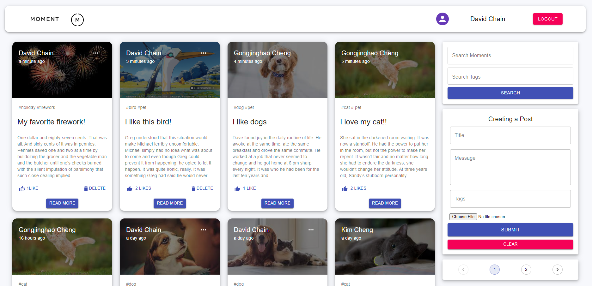

# Moments
### Created in March 2022
### Updated in May 2022 for New Google OAuth

## Table of contents
* [General info](#general-info)
* [More Functionalities](#more-functionalities)
* [Technologies](#technologies)

## General info
This project is a web application that allows users to share best moments in life and interact with others.

#### Demo

The project has achieved following functions:
* View post as guests
* Sign up/sign in with or without Google accounts
* User can create, edit, delete, search, like, comment on posts
* Reommend posts based on tags

## More Functionalities
* A good next stage development will be creating a follower and followee system
	
## Technologies
Project is created with:
#### FrontEnd
* react version: 16.12.0
* axios version: 0.19.2
* jwt-decode version: 3.1.2
* react-redux version: 7.2.8

#### BackEnd
* node version: 16.14.2
* cors version: 2.8.5
* express version: 4.18.1
* jsonwebtoken version: 8.5.1
* mongoose version: 6.3.5

#### DataBase
* MongoDB
